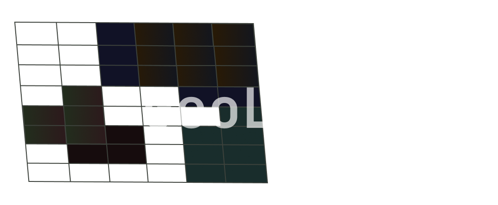

# GeoLinkage — QGIS Plugin


GeoLinkage is a plugin for **QGIS (4.x)** that automates the creation of linkage files for integrated **WEAP-MODFLOW** models.

It receives Shapefile maps containing the information for Catchments, Groundwater and Demand Sites, and overlays them over an empty linkage file provided by the user, or obtained directly from the MODFLOW model with FloPy.

It also receives the WEAP arcs and nodes in Shapefile format, and checks the consistency with the maps.

The newest update added a GeoChecker module, meant to check restrictions over the resulting Linkage file, currently checks if a superposition in one or more cells of Groundwater-Catchment and Groundwater-DemandSite is corresponded by a link in the WEAP model.

This repository is a QGIS migration of the original plugins for GRASS  [GeoLinkage](https://github.com/ftucl/geolinkage) and [GeoChecker](https://github.com/AntonioTorga/GeoChecker).

> [!TIP]
> If you only need the GeoChecker module to identify errors in linkage files, a standalone QGIS plugin is available [here](https://github.com/Kalliam/GeoCheckerQGIS).

*This project is still under development and tested only for structured grid models.*

## Use restrictions

- Not useful for unstructured grid subterranean models (e.g. MODFLOW USG).
- Not supported for QGIS 3.x versions

## Installation (manual)

1. Clone or download the repository:
   ```bash
   git clone https://github.com/Kalliam/geolinkage_project_QGIS.git
   ```

2. Copy the entire plugin folder to the QGIS plugins directory:

   | Operating System | Plugins Path |
   |---|---|
   | **Windows** | `%APPDATA%\QGIS\QGIS4\profiles\default\python\plugins\` |
   | **Linux** | `~/.local/share/QGIS/QGIS4/profiles/default/python/plugins/` |
   | **macOS** | `~/Library/Application Support/QGIS/QGIS4/profiles/default/python/plugins/` |
> [!NOTE] 
> If the "plugins" folder does not exist, create it.

3. Open OSGeo4W Shell and install the required packages with:
   ```bash
   python -m pip install flopy pyshp seaborn anytree
   ```

4. Restart QGIS.

5. Activate the plugin from **Plugins → Manage and Install Plugins → Installed** → check **GeoLinkage**.


## Usage

### 1. Prepare the QGIS project

Before opening the plugin, make sure to:

- Define the project CRS (*Project → Properties → CRS*).
  > In case of using the generated grid from MODFLOW, define it on UTM format.
- Load your shapefile files in the QGIS layers panel.

### 2. Open the plugin

Go to **Plugins → GeoLinkage → Run GeoLinkage**.

A dialog box with two tabs will open:

### 3. "Main Layers" Tab

#### Option A — Extracted MODFLOW grid (default)
- Select the uploaded **grid layer** from the dropdown.
- Assign the attribute table columns representing **row**, **col**, and **cat** (cell ID) of the grid layer shapefile.

#### Option B — Generate grid from MODFLOW
- Check the box **Get the input linkage shapefile generated by FloPy"**.
- Select the `.dis` or `.nam` file of the MODFLOW model.
- Configure the real-world coordinates for the lower-left corner of the grid (**X**, **Y**) and the Rotation of the groundwater model around the **Z** axis.
- The plugin will use FloPy to generate the grid as a temporary layer.

#### Catchment and Groundwater Layers
- Select each layer that contains Catchment and Groundwater information, and the name of the column that identifies each polygon on the shapefile attributes.

### 4. "WEAP/Output" Tab

#### River Schematic
- Select the nodes layer (points) and the arcs layer (lines).
- Assign the attribute table columns of the shapefile for node name, node type, and arcs.

#### Demand Sites
- Wells file (`.txt`): path to the text file defining well locations *(optional)*.
- Area layers: check the uploaded layers in the project that represents demand areas.
- DS Prefix: Sets the ID that will be written on DS1-DS4 columns when the user's demand area Shapefile does not have a column with identifiers. For example, if the cell intersects an area, and DS prefix is "Agricola", the processor will generate the name "Agricola_norte_12" and will save it inside the final DS1 column.

#### Output Configuration
- Run GeoChecker: if checked, then the consistency check will be performed after the linkage file is generated.
- Select the results folder where geolinkage and geochecker files will be saved, this folder will open once the process is finished. *The linkage and checker files will be replaced if the same folder is selected twice.*


Once it's all configured, press **run** to start the plugin.

> [!IMPORTANT] 
> QGIS may take a while to process the data once the 'run' button is pressed. Depending on the complexity of the model and the size of the files QGIS may even freeze on run. Do not close QGIS, wait until it finishes the process.
### 5. Result

The plugin generates the `linkage_final.shp` file in the selected folder. This Shapefile contains the original grid with the following added columns:

| Column | Content |
|---|---|
| `GW` | Name of the groundwater area intersecting the cell |
| `CATCH` | Name of the catchment intersecting the cell |
| `RIVER` | Name of the river/reach intersecting the cell |
| `DS1`–`DS4` | Demand sites intersecting the cell |

if GeoChecker checkbox was checked, then there will be a new folder called "geoChecker_results" that will show the results of the consistency check.

---
